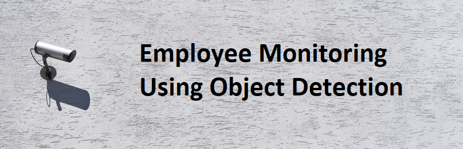

# Employee-Monitoring-Using-Object-Detection

Deep Learning Individual Project - March 03, 2022. The code, analysis, and the full report are included in the [Technical Report](https://github.com/pgplarosa/Employee-Monitoring-Using-Object-Detection/blob/main/md/Individual%20Project%20Report_La%20Rosa.md). If you have any questions regarding this study, please send me a message via  [LinkedIn](https://www.linkedin.com/in/patricklarosa/).

## Executive Summary

Since the pandemic is finally softening and nearing its end, many companies are returning to the office. However, we encounter some forgotten problems as we stay in the office. As an employee, overtime hours are usually not reflected in our salary because we cannot track and justify how long we have worked in a day. On the other hand, as an employer, we are not sure how long an employee works in a day, primarily when the company supports a flexible schedule. Some employee could easily cheat their time which happened to our small business before. This project aims to answer. How might we ensure fairness in tracking hours worked for employees?

The solution I implemented in this project is to use deep learning techniques to detect an employee and monitor the time the employee is seated in their station. Another feature of this project is to count the number of people inside the office. To be able to track if there are some violations of social distancing.

I extracted 200 sample frames from an office's closed-circuit television (CCTV) footage, then trained a custom YOLO model to detect employees with the manually labeled sampled images as a training and validation set. I set a threshold depending on the Intersect Over Union (IoU) of the employee to each station to determine if the seat is taken or vacant. To measure the time the employee is seated at the station, I performed Optical Character Recognition (OCR) to the time of the CCTV footage presented on the screen to have a more accurate result than using frames per second of the camera might vary. 

The application of transfer learning on YOLO increased the average precision from 69% trained on the COCO dataset to 98% in our custom dataset. This allows for robust and real-time detection when deployed as a real-time employee tracker. Thresholding for rules values depends on the camera angle and distinguishes between employees and edge cases.

Recommendations for this project involve additional features outside of the current scope, like detection of the actual action of the employee if they are talking, or working, among others. Further recommendations involve alternative use cases for the system. With modifications to the implementation, this system may be redeployed for parking management, security systems, and traffic management.

https://user-images.githubusercontent.com/67182415/177245750-7488612b-f820-4b33-95b0-74e9ad26776e.mov

**Author**

* La Rosa, Patrick Guillano, P.
